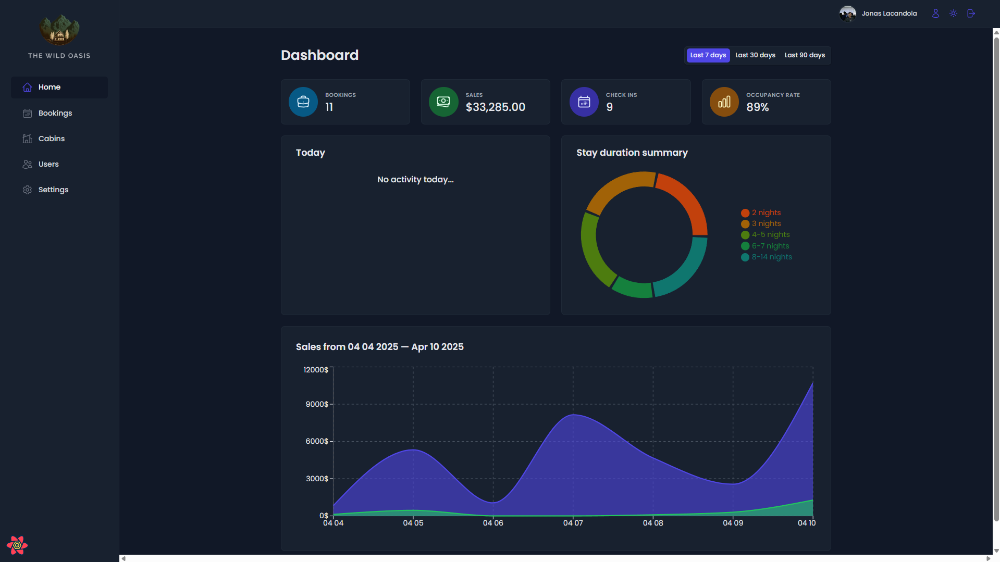
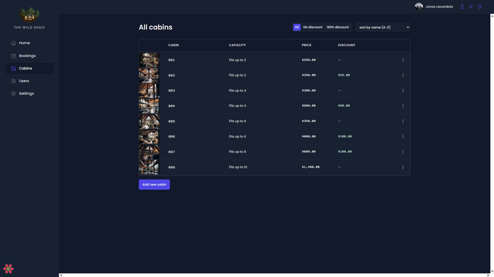
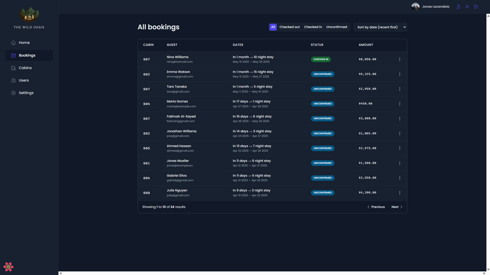

<div align="center">
  

  <h1>The Wild Oasis</h1>
</div>
**The Wild Oasis** is a modern full-stack web application for managing cabin rentals — built with React and Supabase. It offers a sleek dashboard interface to manage bookings, guests, and cabins efficiently, making it ideal for hosts and property managers who want a simple and intuitive experience.

## 🚀 Features

- 🔐 Secure user authentication via Supabase
- 🏕️ Manage cabins, guests, and bookings (CRUD)
- 📈 Real-time dashboard with analytics
- 🌙 Light and dark mode support
- 📅 Booking calendar and filters
- 🖼 Upload and preview cabin images
- 📍 Role-based access ready (optional)
- 📱 Fully responsive UI

## 🛠 Tech Stack

### Frontend

- **React** (with Vite for fast build and hot reload)
- **React Query** – server state and caching
- **React Router** – client-side routing
- **Styled Components** – scoped styling
- **Recharts** – for analytics and charts

### Backend & Database

- **Supabase** – Postgres DB, Auth, Storage
- **Supabase Storage** – image handling
- **Row-Level Security (RLS)** – fine-grained access control

## 📁 Folder Structure

📁 src
├── components # Shared UI components
├── features # Feature modules (cabins, bookings, etc.)
├── services # Supabase client and API logic
├── ui # Styled UI elements (buttons, forms, etc.)
├── utils # Helper functions
└── App.jsx # Main entry point

## 🧑‍💻 Getting Started

### 1. Clone the repository

```bash
git clone https://github.com/your-username/the-wild-oasis.git
cd the-wild-oasis
```

### 2. Install dependencies

```bash
npm install
```

### 3. Set up Supabase

- Go to [supabase.com](https://supabase.com) and create a new project
- Use the provided SQL in `/supabase/schema.sql` to create tables
- Enable storage and auth

### 4. Add environment variables

Create a `.env` file in the root directory:

```env
VITE_SUPABASE_URL=https://your-project.supabase.co
VITE_SUPABASE_KEY=your-anon-key
```

### 5. Start the development server

```bash
npm run dev
```

---

## ⚙️ Supabase Configuration

- Enable **RLS (Row-Level Security)** on all tables
- Add policies for SELECT, INSERT, UPDATE, DELETE
- Use Supabase Storage for cabin image uploads
- (Optional) Add a foreign key relationship to `auth.users` for multi-user support

---

## 📸 Screenshots

| Dashboard                                    | Manage Cabins                          | Booking Details                          |
| -------------------------------------------- | -------------------------------------- | ---------------------------------------- |
|  |  |  |

## 🧑 Author

Made with ❤️ by [Jonas Lacandola](https://github.com/jonaslacandola0617)

## 📄 License

Licensed under the [MIT License](./LICENSE).

## Acknowledgments

This app was developed as part of the [Udemy course](https://www.udemy.com/course/the-ultimate-react-course) by **Jonas Schmedtmann**. Special thanks to Jonas for his excellent teaching and guidance throughout the course.
